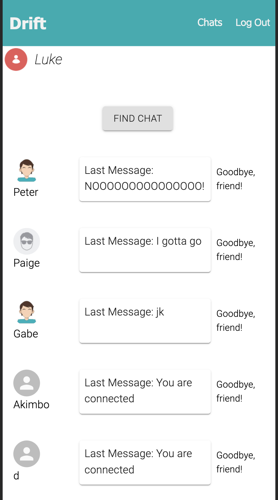
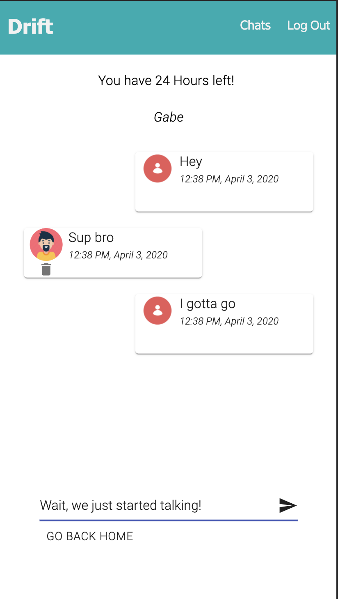

# Drift

Drift is a mobile first anonymous chat app with timed conversations. It's designed to give users a feeling of meeting somebody while travelling, knowing you'll never see them again. Users who are looking for a chat at the same time will be matched together for 24 hours. When the chat shuts off, the chat history will still be there in a user's history, but the user won't be able to continue the conversation. 

This project uses React, Redux, Express, Passport, PostgreSQL, and Socket-IO (a full list of dependencies can be found in `package.json`).

## Prerequisites

1. Before you get started, make sure you have the following software installed on your computer:

- [Node.js](https://nodejs.org/en/)
- [PostrgeSQL](https://www.postgresql.org/)
- [Nodemon](https://nodemon.io/)

2. Create a new database named drift.
3. Create a `.env` file at the root of the project and paste this line into the file:
    ```
    SERVER_SESSION_SECRET=superDuperSecret
    ```
    While you're in your new `.env` file, take the time to replace `superDuperSecret` with some long random string like `25POUbVtx6RKVNWszd9ERB9Bb6` to keep your application secure. Here's a site that can help you: [https://passwordsgenerator.net/](https://passwordsgenerator.net/). If you don't do this step, create a secret with less than eight characters, or leave it as `superDuperSecret`, you will get a warning.
4. Run the queries that are stored in the database.sql file to populate the tables and insert the values you'll need. Postico is recommended for running the queries.
5. In your terminal navigate to this project and run npm install to install all of the necessary dependencies.
6. Run npm run server to start the server
7. Run npm run client to open a new browser window.

## Usage

After registering an account, click the find chat button. The app will for 60 seconds for another user. If another user is looking in that time, you will be matched. You can use the chats button in the header to see a list of your chats. This will give you how much time you have left, as well as the last message sent. If you click on the message, you will be taken to the chat. 






## Acknowledgements

Thank you to Prime Digital Academy for the amazing education. Thank you to Dane Smith for guiding the class through these projects. Thank you to my cohort for a once-in-a-lifetime experience. 


